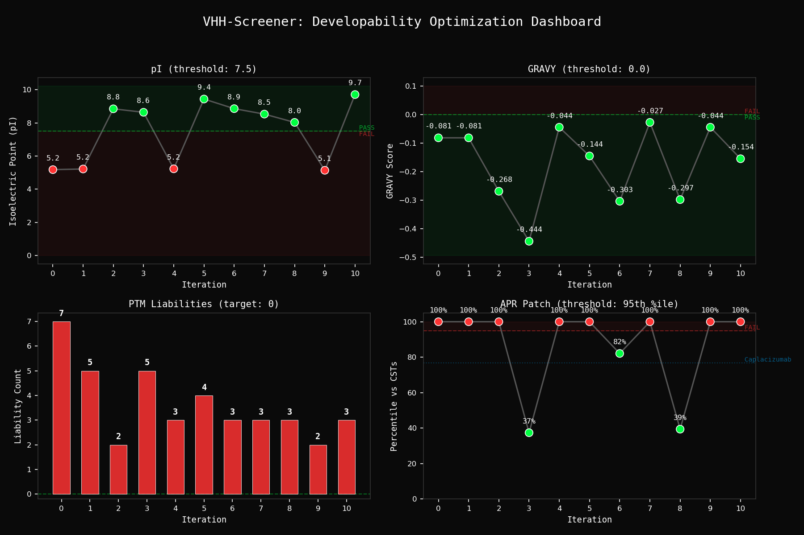

# VHH-Screener: Agentic Developability Screening for Nanobody Engineering


## What This Does

An LLM agent designs VHH nanobody sequences and immediately evaluates them against a panel of deterministic developability checks. If any check fails, the agent proposes targeted point mutations and re-evaluates. The loop runs until the candidate satisfies all constraints or the iteration budget is exhausted.

The screening tools are deterministic and sequence-level: no generative inference, no stochastic variation. The agent does the reasoning; the tools do the measurement.

## The Loop

```
GENERATE → SCREEN → CRITIQUE → MUTATE → RE-SCREEN → ... → PASS
```

1. Generate - Propose a VHH sequence with CDR loops targeting the binding epitope.
2. Screen - Run all four sequence-level screening tools against the candidate.
3. Critique - Diagnose each failure: exact motif, position, mechanism, manufacturing consequence.
4. Mutate - Apply point mutations to fix liabilities while preserving binding geometry.
5. Re-Screen - Re-test the revised sequence. Repeat until all constraints are met.

## Screening Tools

### Liability Scanning (PTM Hotspots)

Deterministic regex - no LLM inference, no stochastic variation.

| Liability | Motif | Mechanism |
|---|---|---|
| Deamidation | NG, NS, NA | Asparagine deamidation via succinimide intermediate |
| Isomerization | DG | Aspartate isomerization to iso-Asp |
| N-Glycosylation | N-X-S/T (X != P) | Aberrant glycosylation at consensus sequons |

### Biophysical Profiling (pI / GRAVY)

- pI < 7.5: precipitation risk near physiological pH
- GRAVY > 0.0: elevated hydrophobicity, aggregation-prone

### Aggregation-Prone Region Scanner (APR)

Sliding-window hydrophobicity analysis using a 7-residue window on the Kyte-Doolittle scale. Patches are scored as z-scores and percentiles against a pre-computed distribution of max-patch scores from 13 clinical-stage VH/VHH domains (3 VHH: Caplacizumab, Ozoralizumab, Envafolimab; 10 mAb VH: Pembrolizumab, Nivolumab, Trastuzumab, Adalimumab, Rituximab, Bevacizumab, Atezolizumab, Durvalumab, Ipilimumab, Crizanlizumab). Sequences were extracted from public PDB structures and patent filings.

A candidate fails only if its worst patch exceeds the 95th percentile of this clinical distribution (threshold: 1.971 mean KD/residue). The calibration anchors Caplacizumab (first approved VHH, anti-vWF; PDB 7EOW) at the 77th percentile (max patch 1.686 KD/residue), grounding the threshold in empirical manufacturing survival rather than textbook heuristics.

### VHH Hallmark Audit (FR2 Tetrad)

Checks Kabat positions 37, 44, 45, 47 for camelid vs. human VH identity. These positions distinguish camelid VHH from conventional VH: the camelid tetrad (F/E/R/G) compensates for the absence of VL by providing a hydrophilic interface where conventional VH has a hydrophobic VH-VL contact surface.

| Kabat Position | Camelid | Human VH | Role |
|---|---|---|---|
| 37 | F | V | Core packing; compensates for missing VL |
| 44 | E | G | Hydrophilic substitution at former VH-VL interface |
| 45 | R | L | Charged residue replacing hydrophobic VL contact |
| 47 | G | W | Flexible Gly replacing bulky Trp |

### SASA-Aware Liability Filtering

Filters the PTM liabilities identified above by solvent-accessible surface area. Loads a PDB structure, computes per-residue SASA with FreeSASA (Lee-Richards algorithm), then splits liabilities into exposed (SASA >= threshold) and buried (SASA < threshold). Buried motifs are rarely modified in practice; filtering them reduces false positives that waste agent iterations.

```
sasa_threshold = 25.0 Ų  (standard developability threshold)
```

Requires a PDB file as input - designed to be called after `predict_vhh_complex_structure`. CPU-only; no GPU required.

### Structure Prediction (Boltz-2)

Predicts the 3D structure of a VHH-antigen complex using Boltz-2. Returns iptm, ptm, complex_plddt, and per-interface confidence scores. Defaults to Human PD-1 ectodomain as the antigen target.

GPU required for inference (min 8 GB VRAM). Use `dry_run=True` for input validation and YAML generation without running inference - suitable for CI and local testing.

```
iptm >= 0.8  High confidence binding interface
iptm >= 0.6  Plausible interface, verify experimentally
iptm <  0.6  Low confidence, consider redesign
```

Boltz-2 was chosen over AlphaFold-Multimer for better accuracy on antibody-antigen complexes; MIT license.

## Architecture

```
agent_loop.py                    biologics_server.py
┌─────────────────────┐          ┌──────────────────────────────────────┐
│  LLM Agent          │  import  │  Screening Tools                     │
│  (DeepSeek V3 /     │────────→ │                                      │
│   Together AI)      │          │  scan_structural_liabilities         │
│                     │          │  calculate_biophysical_profile       │
│  Generate → Screen  │←──────── │  vhh_hallmark_audit                  │
│  → Critique → Mutate│  JSON    │  scan_aggregation_patches            │
└─────────────────────┘          │  filter_liabilities_by_sasa  (CPU)   │
        │                        │  predict_vhh_complex_structure (GPU) │
        ▼                        └──────────────────────────────────────┘
  logs/agent_cot.log                              │
                                         tools/boltz2_structure.py
benchmark.py
┌─────────────────────┐
│  Benchmark Runner   │
│  N runs × seed      │
│  pass rate / cost   │
│  → logs/*.json      │
└─────────────────────┘
```

Two usage modes:

- Automated - `python agent_loop.py` runs the full generate-screen-mutate loop unattended via OpenAI-compatible API.
- Interactive - register `biologics_server.py` as an MCP server in Claude Code, then call the tools on demand during a conversation.

### Developability Dashboard



Four-panel dashboard generated automatically at the end of each run. Tracks pI, GRAVY, liability count, and APR percentile across iterations. Points labeled "NA" were imputed by carry-forward when the agent skipped a tool on a given iteration.

## Quickstart

```bash
git clone https://github.com/ChristopherSNelson/VHH-Screener.git
cd VHH-Screener
pip install -e ".[dev]"
export TOGETHER_API_KEY="your-key-here"
python agent_loop.py --seed naive
```

Seed options:

| `--seed` | Description |
|---|---|
| `naive` (default) | Deliberately bad starting sequence - 7 liabilities, low pI, APR 100th percentile. Maximizes the red-to-green arc in the dashboard. |
| `pembrolizumab` | Pembrolizumab heavy chain VH - real clinical sequence, humanized FR2. |
| `none` | Zero-shot: agent designs from scratch without a seed. |

Environment variables:

| Variable | Default | Description |
|---|---|---|
| `TOGETHER_API_KEY` | *(required)* | Together AI API key |
| `MODEL_ID` | `deepseek-ai/DeepSeek-V3` | Any OpenAI-compatible model on Together AI |

See `examples/example_run.log` for a complete captured run (6 iterations, all PASS, $0.0077).

### Benchmarking

```bash
python benchmark.py --seed naive --n 5
python benchmark.py --seed all --n 3                          # naive + pembrolizumab + none
python benchmark.py --seed naive pembrolizumab --n 5 --model meta-llama/Llama-3.3-70B-Instruct-Turbo
```

Runs the screening loop N times per seed/model combination. Reports pass rate, mean iterations, cost per design, and stddev. Results are saved to `logs/benchmark_<seed>_<model>_<timestamp>.json` for downstream analysis. Use this to compare seed strategies or models before committing to a longer run.

## Developability Constraints

Hard requirements. A candidate does not pass unless all are satisfied.

| Constraint | Threshold | Rationale |
|---|---|---|
| Isoelectric point | pI > 7.5 | Avoid precipitation near physiological pH |
| Hydropathy | GRAVY <= 0.0 | Minimize aggregation propensity |
| Aggregation-prone regions | Below 95th percentile of CSTs | Clinically-calibrated patch detection |
| Deamidation motifs | Zero detected | Eliminate shelf-life degradation risk |
| Isomerization motifs | Zero detected | Prevent charge heterogeneity |
| N-glycosylation sequons | Zero detected | Ensure batch consistency |
| FR2 hallmark tetrad | Assessed and documented | Structural integrity of VHH scaffold |

Note: liability scanning covers the full sequence. CDR-specific masking (to distinguish framework from CDR liabilities) is a planned extension.

## Tests

```bash
pip install -e ".[dev]"
python -m pytest tests/ -q
```

83 tests covering five screening tools and the Boltz-2 structure predictor. Regression anchors use Caplacizumab (PDB 7EOW, first approved VHH) and Pembrolizumab VH (PDB 5DK3, chain B) with verified expected values. Boltz-2 tests use `dry_run=True` - no GPU required. SASA filter tests download PDB 7EOW from RCSB at runtime and are skipped automatically if the network is unavailable.

## Technical Heritage

Zero-shot binding strategy adapted from the [Escalante 180-line approach](https://blog.escalante.bio/180-lines-of-code-to-win-the-in-silico-portion-of-the-adaptyv-nipah-binding-competition/), which won the in-silico portion of the Adaptyv Nipah binding competition. That work demonstrated that structured zero-shot prompting with a clear binding epitope can produce credible VHH designs without fine-tuning or MSA inputs. VHH-Screener extends that baseline with a deterministic developability filter applied at every iteration, ensuring designs are optimized for manufacturability alongside binding plausibility.

## Roadmap

Sequence-level and structure-level tools are implemented. Planned extensions:

### 1. Inverse Folding

AntiFold for CDR sequence optimization conditioned on 3D scaffold coordinates. Purpose-built for antibodies with better CDR sequence recovery than ProteinMPNN. Requires Boltz-2 structure prediction as a prerequisite.

### 2. Immunogenicity

- AbLang2 / AntiBERTa2 for OAS-perplexity scoring - log-likelihood of the VHH sequence against Observed Antibody Space. High perplexity signals immunogenicity risk. Antibody-specific language models; more accurate than general protein models (ESM-2) for this task.
- BigMHC for MHC presentation prediction - trained on mass-spec data (peptides actually presented on cell surface), not binding affinity proxies like NetMHCpan.

### 3. Search Strategy

- MCTS-based mutation exploration instead of linear iteration - explore parallel mutation branches, prune early failures, avoid local optima.
- Multi-agent Generator vs. Screener adversarial debate - Generator proposes designs that exploit gaps in deterministic rules, driving more robust screening criteria.

## License

MIT

## Author

Chris Nelson

- [LinkedIn](https://www.linkedin.com/in/christopher-s-nelson/)
- [GitHub](https://github.com/ChristopherSNelson)
